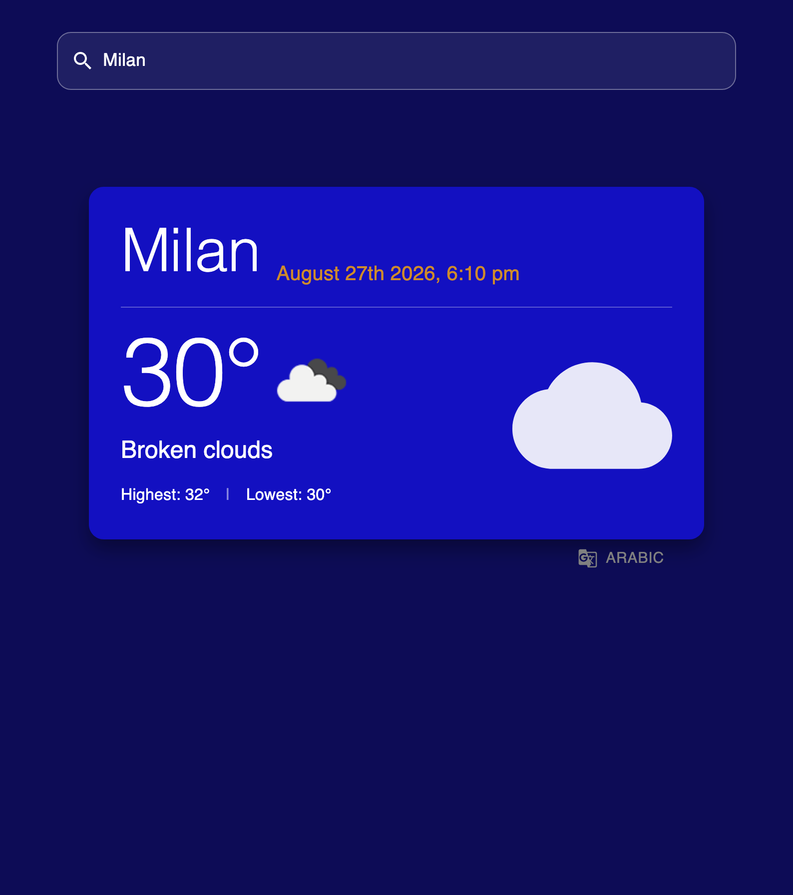
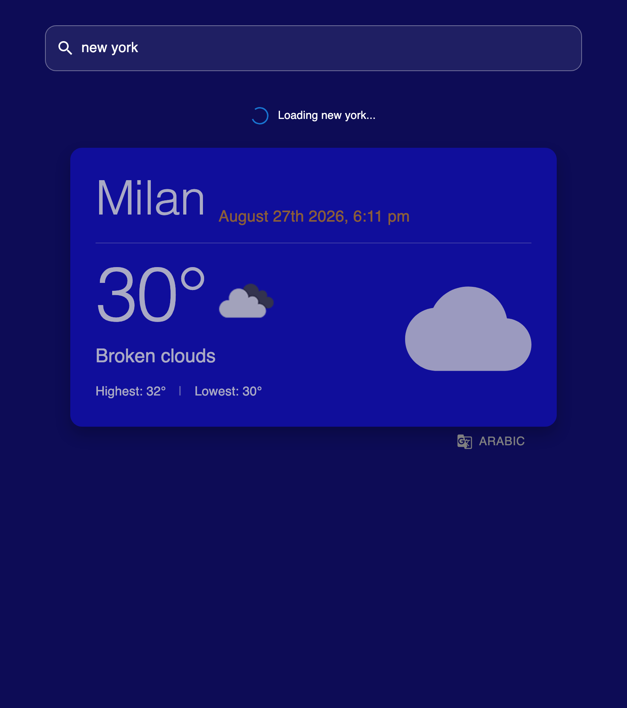
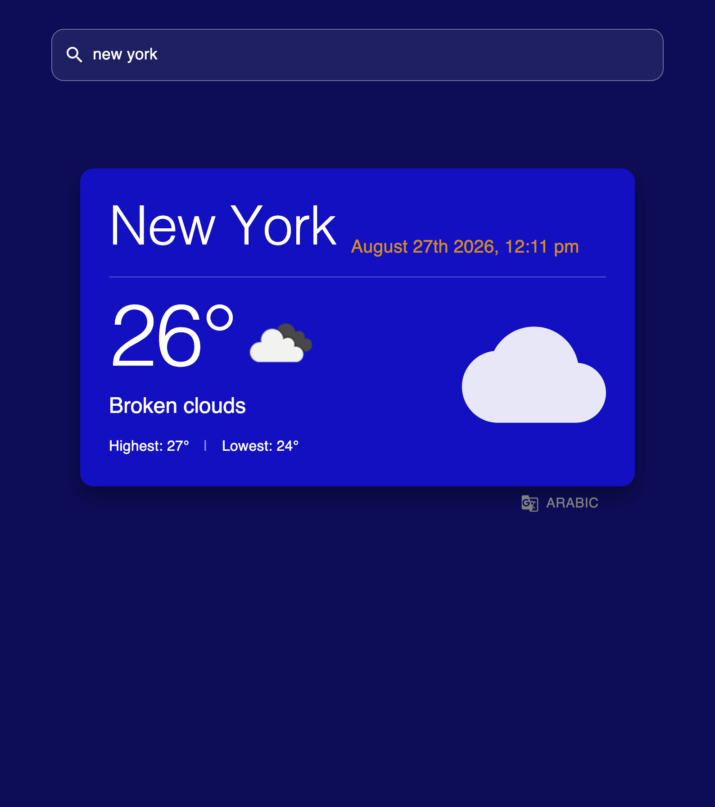
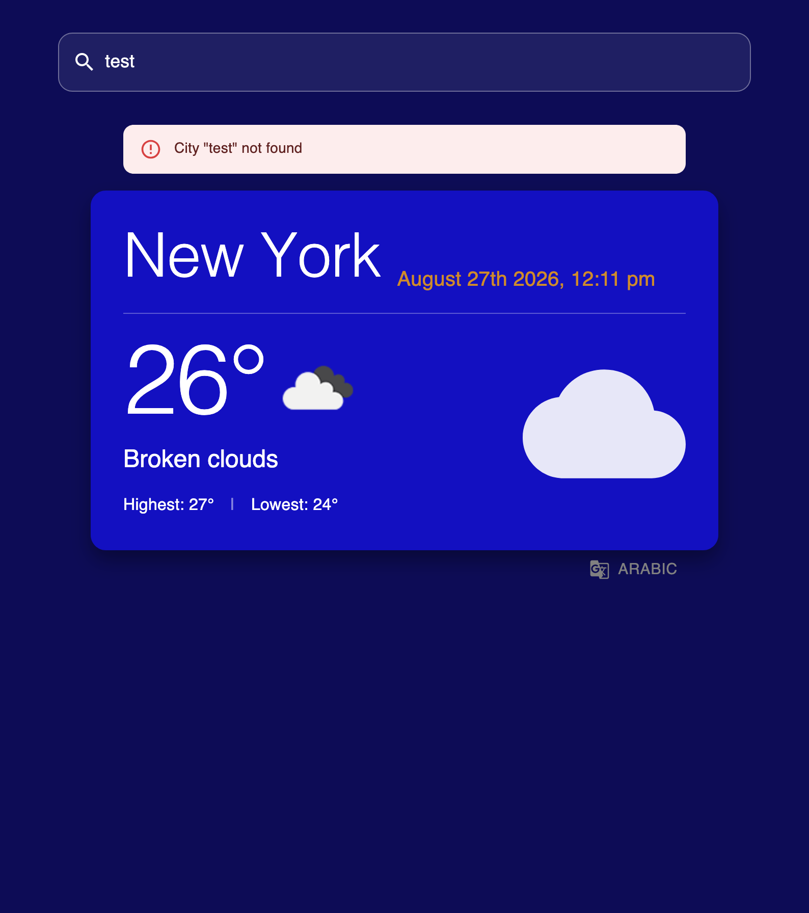

# Weather App

A responsive weather application built with React and TypeScript.

The application allows users to search for a city and display its current weather information. It includes optimized API requests with debounced search, loading and error states, multilingual support, and local time based on the selected city's timezone.

---

## Summary

- [Features](#features)
- [Technologies](#technologies)
- [Weather Search](#weather-search)
- [Debounced Search](#debounced-search)
- [Loading State](#loading-state)
- [Error Handling](#error-handling)
- [Multilingual Support](#multilingual-support)
- [City Local Time](#city-local-time)
- [Request Flow](#request-flow)
- [Screenshots](#screenshots)
- [Project Structure](#project-structure)
- [Environment Variables](#environment-variables)
- [Installation](#installation)
- [Screenshots](#screenshots)

---

## Features

- Search weather by city name
- Display current temperature
- Display minimum and maximum temperature
- Display weather condition
- Display weather icon
- Display local date and time for the selected city
- English and Arabic language support
- RTL and LTR layout support
- Debounced search to reduce unnecessary API requests
- Loading state while fetching weather data
- Keep the previous successful weather result visible while loading a new city
- Error handling for invalid city searches
- Keep the last successful result visible when a new search fails
- Responsive interface using Material UI

---

## Technologies

- **React** - UI and component-based architecture
- **TypeScript** - static typing
- **Vite** - development and build tool
- **Material UI (MUI)** - UI components and styling
- **Axios** - HTTP requests
- **OpenWeather API** - weather data
- **i18next**
- **react-i18next** - internationalization
- **Moment.js** - date and time formatting

---

## Weather Search

The user can type a city name into the search field.

The application sends a request to the OpenWeather API and displays:

- City name
- Current temperature
- Minimum temperature
- Maximum temperature
- Weather description
- Weather icon
- Local date and time

---

## Debounced Search

The search input uses a debounce mechanism to reduce unnecessary API requests.

For example, when the user types:

`L` → `Lo` → `Lon` → `Lond` → `London`

the application does not immediately send a request after every character.

Instead, it waits for a short delay after the user stops typing before starting the API request.

This reduces the number of requests sent to the weather API and improves the search behavior.

---

## Loading State

The application manages a loading state while requesting weather information.

If weather data already exists, the previous result remains visible while the new city is being loaded.

Example:

1. The user searches for **Milan**.
2. Milan weather is displayed.
3. The user searches for **New York**.
4. A loading indicator is displayed.
5. Milan weather remains visible during the request.
6. When the request succeeds, Milan is replaced by New York.

This prevents the interface from becoming empty during every new request.

---

## Error Handling

The application handles failed or invalid city searches.

Example:

1. New York weather is currently displayed.
2. The user searches for an invalid city.
3. The API request fails.
4. An error message is displayed.
5. The previous successful New York weather remains visible.

This keeps the interface stable while informing the user that the new search failed.

---

## Screenshots

The screenshots below demonstrate the main application states and request flow.

### 1. Milan - Successful Search

The user searches for **Milan** and the current weather information is displayed.



### 2. New York - Loading State

The user searches for **New York**.

While the new request is loading, the application keeps the previous Milan weather result visible and displays a loading indicator.



### 3. New York - Successful Result

After the API request succeeds, the New York weather data replaces the previous Milan result.



### 4. Invalid City - Error State

The user searches for an invalid city.

The application displays an error message while keeping the last successful New York weather result visible.



---

## Multilingual Support

The application supports:

- English
- Arabic

Internationalization is implemented using:

- `i18next`
- `react-i18next`

The document direction also changes depending on the selected language.

For English:

```text
LTR

```
